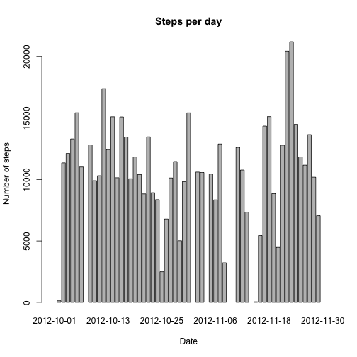
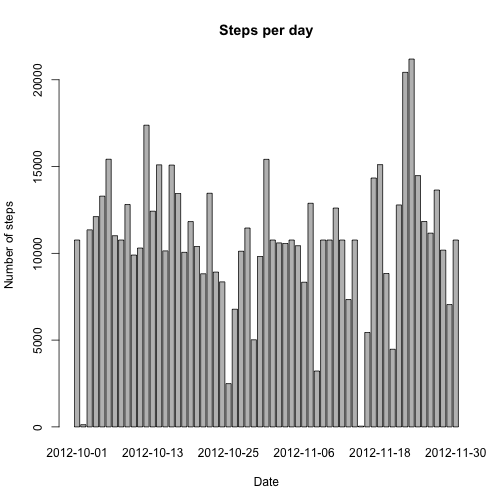
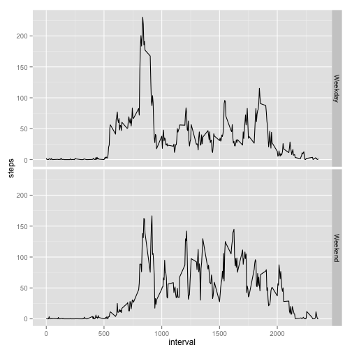

# Reproducible Research: Peer Assessment 1'


```r
require(timeDate)
require(ggplot2)
```


## Loading and preprocessing the data


```r
unzip("activity.zip")
activity <- read.csv("activity.csv")
```


## What is mean total number of steps taken per day?

First we aggregate data by day.

```r
day.steps <- aggregate(activity$steps, by=list(activity$date), "sum")
colnames(day.steps) <- c("date", "steps")
```

Plotting the total steps per day


```r
barplot(day.steps$steps,
        names.arg=day.steps$date,
        main="Steps per day", 
        xlab="Date",
        ylab="Number of steps")
```

 

The total steps per day have the following mean and median values.


```r
mean.steps <- mean(day.steps$steps, na.rm = TRUE)
median.steps <- median(day.steps$steps, na.rm = TRUE)
```

Mean: 10766  
Median: 10765  

## What is the average daily activity pattern?

First we aggregate data by interval.

```r
interval.steps <- aggregate(activity[,c("steps")], by=list(activity$interval),na.rm=TRUE, "mean")
colnames(interval.steps) <- c("interval", "steps")
```

Plotting the average steps by time interval

```r
plot(interval.steps$interval, interval.steps$steps,
        type="l",
        main="Average steps", 
        xlab="Intervals",
        ylab="Number of steps")
```

 

The max number of steps occurs at the following interval:

```r
max.interval <- interval.steps[which.max(interval.steps$steps),c("interval")]
```

Interval: 835

## Imputing missing values

Total number of missing values in the dataset (i.e. the total number of rows with NAs):

```r
na.sum <- sum(is.na(activity))
```
Missing NA: 2304  
  
Filling in all of the missing values in the dataset. We use the the mean for that 5-minute interval

```r
act.fill <- activity

act.fill$steps[is.na(act.fill$steps)] <- with(act.fill, ave(steps, interval, 
   FUN = function(x) mean(x, na.rm = TRUE)))[is.na(act.fill$steps)]
```

Let's check if our filling method is working. There should not be NA in the new
data frame.

```r
na.fill.sum <- sum(is.na(act.fill))
```
Missing NA on filled data frame: 0 
  
  
Make a histogram of the total number of steps taken each day. 


```r
day.steps.fill <- aggregate(act.fill[,c("steps")], by=list(act.fill$date), "sum")
colnames(day.steps.fill) <- c("date", "steps")


barplot(day.steps.fill$steps,
        names.arg=day.steps.fill$date,
        main="Steps per day", 
        xlab="Date",
        ylab="Number of steps")
```

 

Calculate and report the mean and median total number of steps taken per day:

```r
mean.steps.fill <- mean(day.steps.fill$steps, na.rm = TRUE)
median.steps.fill <- median(day.steps.fill$steps, na.rm = TRUE)
```

By filling NA the mean change from 10766 to 10766  
By filling NA the median change from 10765 to 10766  
  
There are no changes on the values because our filling strategy is using mean values.

## Are there differences in activity patterns between weekdays and weekends?

We use isWeekend function from the timeDate package.

```r
act.fill$weekend <- isWeekend(timeDate(act.fill$date))
act.fill$weekend <- factor(act.fill$weekend)
levels(act.fill$weekend) <- c("Weekday", "Weekend")
```

Let's aggregate data by interval and weekend/weekday

```r
avg.steps <- aggregate(act.fill$steps, by=list(act.fill$interval, act.fill$weekend),na.rm=TRUE, "mean")
colnames(avg.steps) <- c("interval", "weekend", "steps")
```

Plotting a panel plot containing a time series plot (i.e. type = "l") of the 5-minute interval (x-axis) and the average number of steps taken, averaged across all weekday days or weekend days (y-axis).  

```r
ggplot(data=avg.steps, aes(x=interval, y = steps)) + 
  geom_line() + facet_grid(weekend~.)
```

 
